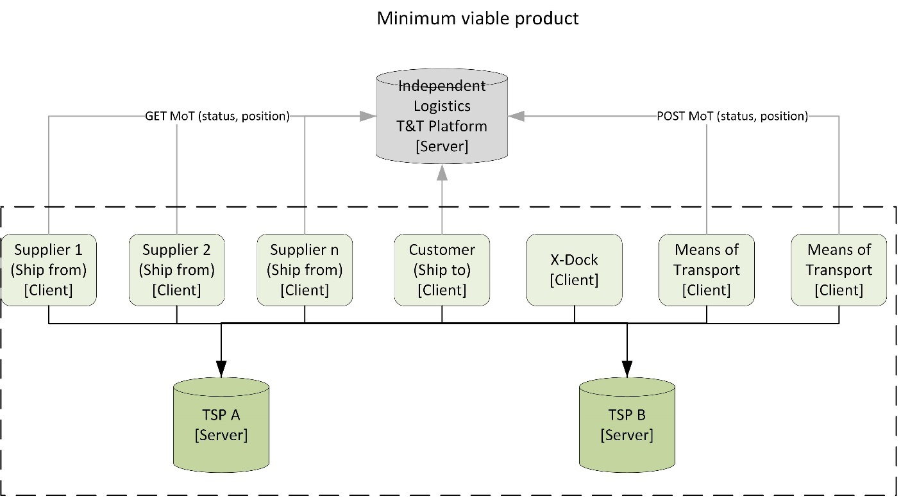
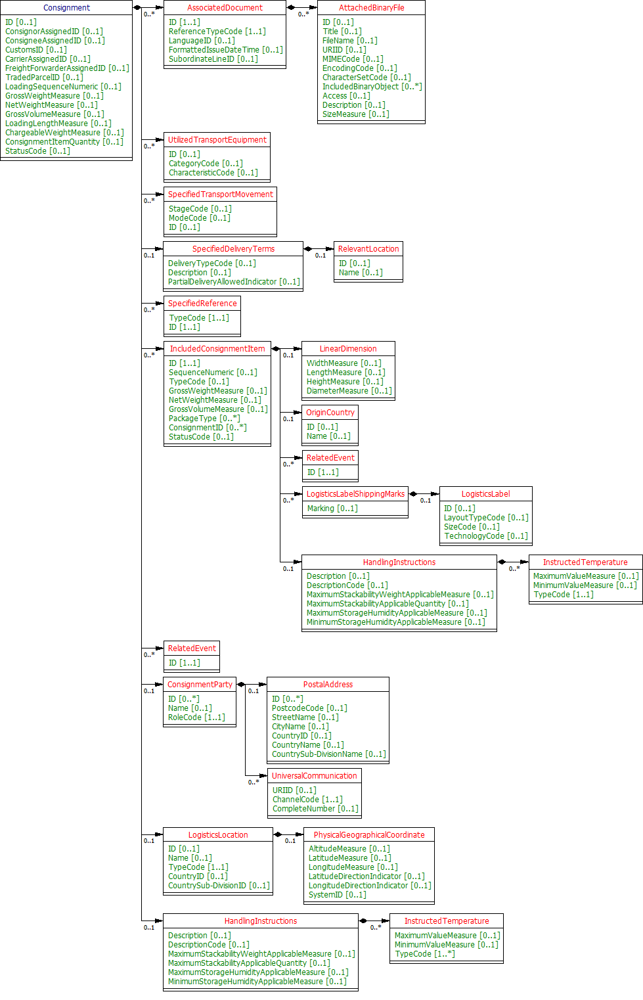
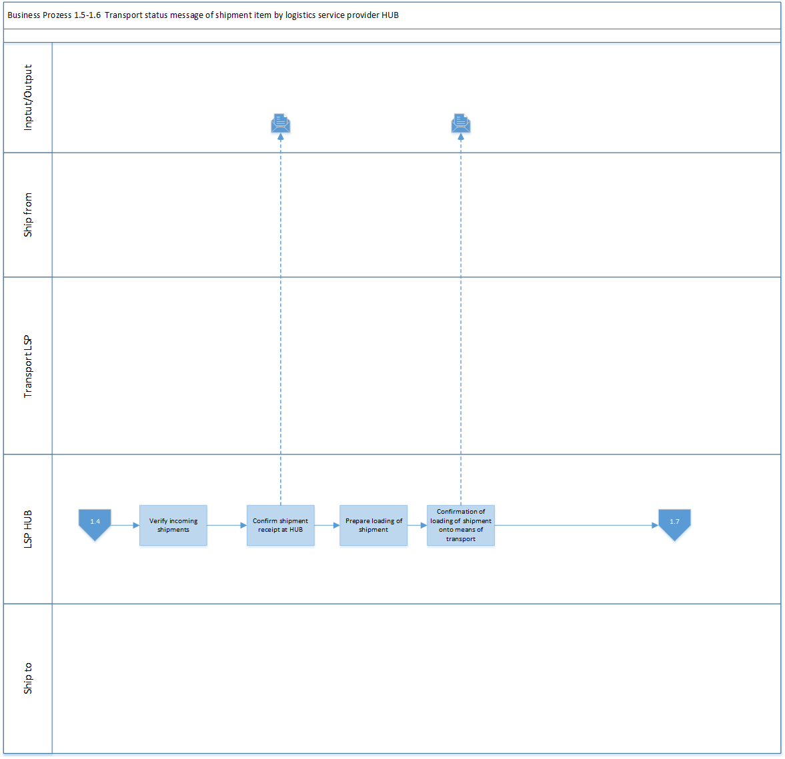
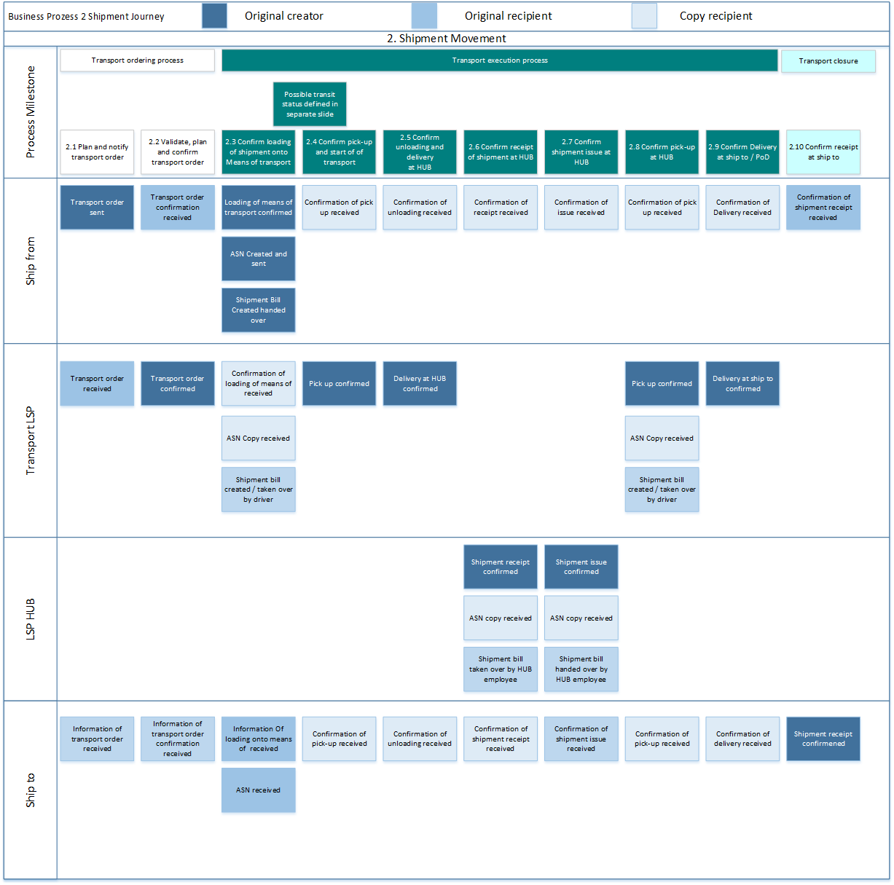

# Transport Track and Trace API for the Automtive Supply Chain

VDA 4998 Part 2/ Odette OA02
Version 1.0, June 2021

**Summary**

This Recommendation describes how to define and implement standardised REST-API interfaces for collaboration within the automotive industry and between the automotive industry and their partners.

Part 1 of the recommendation focusses on technical rules common to all processes.

Part 2 describes the data model and functionality for the use of REST API in transport processes as an extension to established EDI data exchange processes.

**Disclaimer**

The VDA Recommendations are recommendations that may be freely adopted by anyone. Users are responsible for correct implementation of the recommendations as required on a case-by-case basis.

The recommendations take into account the prevailing technology at the time of publication. Use of the VDA Recommendations does not absolve anyone from responsibility for his/her own actions, and all users act at their own risk. Liability of VDA and those involved in drafting of VDA Recommendations is excluded.

Please note: This is an informal copy of the original VDA/Odette recommendation. The official versions are available at www.vda.de and www.odette.org .

|           |                                                              |
| :-------- | ------------------------------------------------------------ |
| Publisher | Verband der Automobilindustrie e.V. (VDA)   Behrenstrasse 35, 10117 Berlin  www.vda.de  This recommendation was developed by AK SID together with an Odette project group. |
| Copyright | Odette International & Verband der Automobilindustrie e.V. (VDA)  Reprint, also in extracts, is only permitted, if the source is stated. Copyright |
| Version   | Version 1.0, June 2021                                       |

If you notice any errors, omissions or ambiguities in these recommendations, please contact VDA without delay so that these errors can be rectified. 

# 1	Introduction and Scope
This part of the recommendation specifies the functionality of a standardised API for Tracking and Tracing shipments on their way from the supplier / ship-from to the customer / ship-to.
It is intended to extend existing, mostly EDI-based systems and to gain more transparency and flexibility in often complex transport processes.

## 1.1	Typical information flow in a transport process
Figure 1 illustrates the typical information flow accompanying the transport process. Flows marked as API are to be added and shall be harmonised by this recommendation.

Figure 1
## 1.2	Functional scope of this specification
The API is designed toshall support track and trace operations during the transport execution phase (see also chapter 3.3.2). Optionally, the ordering phase may be supported by a transport capacity reservation.
A service provider provides an API interface to gather and provide T&T information on:
* Shipments along their complete movement in their area of responsibility / from ship from to ship to;
* Shipment items along their complete movement from ship-from to ship-to;
To achieve this goal, partners in the supply chain shall should be able to perform the following operations:
* Ship-from can provide information on transport events of shipments and shipment items (e.g. loaded);
* Means of transport (or carrier) can provide transport events with reference to a transport movement and/or shipment and/or shipment item;
* Ship-to can provide transport events of shipments and shipment items (e.g. unloaded);
* X-Dock can provide transport events of shipments and shipment items;
* Any authorised party can retrieve information on shipments and shipment items; 
Optional:
* Any authorised party can retrieve information on transport movements and used means of transport.
* A shipper can issue a transport capacity reservation with to a transport service provider. 
The API consumer must be able to link transport movements of means of transport to the shipment they want to track and trace.
## 1.3	Minimum viable product
As described in Part 1 of this recommendation, there are several architectural options to orchestrate communication between partners in the supply chain via API.
This version of the recommendation intends to define data structures, functions, and architecture for a minimum viable product (MVP), i.e. to support the above described information flow with minimal effort.
It assumes the Transport Service Providers (TSP) to be  as the main API service providers as well (although other parties MAY host this kind of service as well). In combination with other, independently available services to track transport means such as like trucks, vessels, aircrafts, and trains (out of scope of this project), this will enable transparency of the whole transport chain.

Figure 2

The following table describes the required functionality of the T&T API.
Operations marked with status M are mandatory, operations marked with O are optional, D stands for dependent.
 
|Path|Operation|Status|Description|
| :- | :- | :- | :- |
|/consignments|GET|M|Returns a list of consignment Ids; filter to be applied|
| |POST|O|Creates a new object and returns the ID assigned by the system. This unique ID is then the primary key to access the object in the system. The response shall also contain a link to the PUT operation.|
|/consignments/{ident}|PATCH|M|Changes or adds parts to an existing consignment (e.g., referenced events)|
| |PUT|M|Creates a new consignment object with all data or replaces an existing consignment object completely.|
| |GET|M|Returns all information on the identified consignment.|
| |GET|M|Returns a list of consignment item Ids; filter to be applied|
|
/consignment-items

 
|GET|M|Returns a list of consignment item Ids; filter to be applied|
||
POST

|
O

|
Creates a new object and returns the ID assigned by the system. This unique ID is then the primary key to access the object in the system. The response shall also contain a link to the PUT operation.

|
|/consignment-items/{ident}|GET|M|Returns the details oif the identified consignment item.|
| |PUT|M|
Provides/replaces the complete information for the identified consignment item. It is assumed that either a) a POST without ID has been used to create an empty object and returned a unique ID, which is now used to provide the content;

b) if an object with this ID does not exist, the system creates anthis object with this ID and stores the data
|
| |PATCH|M|Changes or adds parts of an existing consignment item.|
| |POST|M|Creates an empty event object and returns the id.|
|/transport-events|GET|M|Returns a list of event IDs; filter to be applied.|
| |PUT|M|Provides/replaces the complete information for the event. The identifier had to be created reviouslybefore with a POST operation.|
|/transport-events/{ident}|GET|M|Returns the details of the identified event.|
| |POST|O|Creates an empty object and returns the ID.|
|/transport-capacity-reservations|GET|O|Returns a list of cCapacity reservation IDs; filter to be applied.|
| |PUT|O|Provides/replaces the complete information for the reservation. The identifier had to be created previouslybefore with a POST operation.|
|/transport-capacityreservaions/{ident}|GET|O|Returns the details of the identified capacity reservationa list of reservation IDs; filter to be applied.|
| |GET|O|Returns a list of equipment IDs; filter to be applied.|
|/transport-equipments|GET|O|Returns the details of the identified equipment.|
|/transport-equipments/{ident}|GET|O|Returns a list of means of transport IDs; filter to be applied.|
|/transport-means|GET|O|Returns the details of the identified means of transport.|
|/transport-means/{ident}|GET|O|Returns a list of transport movement IDs; filter to be applied.|
|/transport-movements|GET|O|Returns a list transport movements; filter to be applied.|
|/transport-movements/{ident}|GET|O|Returns the details of the identified transport movement.|

# 2. Data model 
## 2.1 Basic principles
The Logical Data Model is split into subject areas (information objects) to provide a more focused overview of each part of the model, as illustrated in figures below. Each subject area consists of one or more data entities and the related references. 
### 2.1.1 Information Objects
Subject areas in the Logical Data Models are described in the following sections. Each of the subject areas and their relating data entities and data attributes will be described in the following order:

1. Consignment Item (Transport Handling Unit)
1. Consignment (Shipment)
1. Transport Events
1. Transport Movement
1. Means of Transport 
1. Transport Equipment
1. Transport Capacity Reservation

Within each subject area, a class diagram of the structure of the object is provided. 
Further details for each object are listed in Annexe 1.

At least objects under 1, 2 and 3 shall be accessible via an own interface (i.e. path in the API specification), the other objects are optional (see MVP). 
### 2.1.2 Message like structures
Furthermore, this specification provides a methodology to transmit message-like structures such as 

1. Transport Capacity Reservation and Confirmation
1. Transport Order and Confirmation
1. Transport Status Information.

Especially in environments with indirect communication between the service provider and the service consumer, e.g., via a HUB, this feature may be necessary to enable API based communication.   
### 2.1.3 Identification
Each individual information object shall be identified by a unique identifier. To make these identifiers globally unique and usable across various information systems, they can be prefixed by an URN or URI.

Example: A journey identifier assigned by a logistics service provider XYZ could be generated as follows:
*urn:xyz.com/movements/123-ABC-567*

## 2.2 Information objects details
### 2.2.1 Consignment (Shipment)

on Means of transport

on Means of transport, each consignment is identified by a unique reference number, the consignment (or shipment) number.

Consignment is the term preferred by transport industry and used in the UN/CEFACT multi-modal transport reference data model whereas shipment is often the preferred term in the automotive industry. Both terms denominate the same object.

In the UN/CEFACT Multi Modal Transport reference data model the consignment subject area and its entities will allow for the identification of the shipment that a user may want to track, along with all the instances of equipment that have been used to fulfil the shipment and all the locations that are called at, by the specific instances of transport involved in the delivery of that shipment. For overall structure, refer to Figure 3.

Figure 3: Consignment details
### 2.2.2 Consignment item (Transport handling unit -TLU)
A TLU is the part of a shipment, that is individually moved or movable by e.g. a fork lifter. Each TLU shall be uniquely identified by an identifier according to ISO 15459 / ANSI MH 10.8.2, the licence plate. For further details refer to Global Transport Label recommendation VDA 4994 or Odette LL08 respectively. Data Model is shown in Figure 4.

Figure 4: ConsignmentItem details
### 2.2.3 Transport event
Transport event is an information object to communicate requested, scheduled, or actual events along the transport chain. The structure can include binary object so that it is possible to include pictures, for example. Details are shown in Figure 5.

Figure 5: TransportEvent details
### 2.2.4 Transport movement
The transport movement includes information related to the conveyance (physical carriage) of goods. In a segmented transport process, each leg relates to a separate transport movement. Details are shown in Figure 6.

Figure 6: TransportMovement details 
### 2.2.5 Means of transport
Means of transport is the motor vehicle, rail vehicle, aircraft or watercraft used for the transport of goods (and persons).
Details are shown in Figure 7.

Figure 7: TransportMeans details
### 2.2.6 Transport equipment
Additional equipment affixed to or used by the means of transport for loading, unloading, or carrying the cargo.
Details are shown in Figure 8.

Figure 8: TransportEquipment details
### 2.2.7 Transport Capacity Reservation
Transport Capacity Reservation is used to indicate the demand of transport capacity for a certain date or period. It is not yet a firm transport order but helps to ensure enough transport capacity is available when needed. Details are shown in Figure 9.

Figure 9: TransportCapacityReservation details
### 2.2.8 Exchanged Envelope
If the API is used in a Hub/Spoke architecture (see chapter XX in Part 1), then an envelope with routing information is necessary for communication. Any of the above listed information objects can be child of the APIPayload-element. The envelope structure is shown in Figure 10.

Figure 10: ExchangedEnvelope details
# 3. Process model
This chapter describes the business process related to be supported by API communication. Because of the complexity of the logistics transport chain the described solution in this document is limited to use cases of transport planning and notification, transport execution and receipt at the ship to party.
## 3.1 General assumptions
- Detailed information of the actual despatched shipment will be communicated by the ship-from party by using VDA 4987 Global Despatch Advice / as recommended by JAIF, Odette or VDA to the ship-to party.
- A shipment will not be split during the entire transport execution process.
- If contractual responsibility is separated for one or more transport legs, it is assumed that the handover from one party and the takeover of the following party is reported as well.
- Events can be communicated for shipment items (TLU), shipments, and transport movements.
- The data model describes the content of the information of each information object in scope.
- The business partners agree upon individual content of the communication to be set up according to the contracts and the business needs.
## 3.2 Movements
Movement defines the entity being tracked as well as the specific events within the movement. The use cases in scope are supporting the following movements:

- Shipment Item Movement
- Shipment Movement
- Means of Ttransport Movement 

Movement identification: Every movement is identified with a transport movement ID, which stands for a variety of business terms such as journey number, flight number, route number etc.

## 3.3 General Process phases
The general process phases apply to all movement levels.
### 3.3.1 Transport planning and notification
This phase is covering the transport planning process to identify the transport demand and the notification. The supported use cases are:
#### 3.3.1.1 Transport capacity order and confirmation
In a transport capacity order the ordering party does only orders a certain freight capacity for a certain ship- to party forto be picked up on a specificed date ore within a specificed period without specifying the shipment to be loaded. 

The logistic service provider is planning means of transport and transport equipment based on the provided information and confirms the pickup with assigned generic means of transport and if applicable, equipment. In this case the ship from will specify the shipment at the start of the transport execution phase, e.g. with the confirmation of despatch advice message.

#### 3.3.1.2 Detailed transport order / transport order confirmation
In this case the transport ordering process will be supported by the usage of VDA 4933 (EDIFACT message transport order based on Global DESADV) containing all details of the shipment planned to be despatched.

The logistics service provider plans means of transport and transport equipment based on the provided information and confirms the pickup with assigned generic means of transport and if applicable, equipment. In this case the ship from will update the information according to the actual shipment at the start of the transport execution phase with the confirmation of despatch.
### 3.3.2 Transport execution
This process phase describes all possible events that may occur from despatch of the shipment at the ship-from party to the delivery at the ship to

The ship-from confirms the loading of shipment into means of transport or equipment. With this confirmation the connection between shipment and means of transport or shipment and transport equipment must be established. 

The transport service provider confirms the pick-up of shipment to means of transport or transport equipment at ship-from.

On arrival at HUB the transport service provider confirms the delivery of the shipment or transport loading unit. The receipt at HUB has to be confirmed by the logistics service provider who is responsible for the HUB. When the shipment or the TPU’s will be despatched, the logistics service provider has to confirm the goods issue.

The transport service provider confirms the pick-up of shipment to means of transport or transport equipment at HUB.

On arrival at Ship-To the transport service provider confirms the delivery of the shipment or transport loading unit with a proof of delivery.

### 3.3.3 Transport execution
This process phase describes all possible events that may occur from despatch of the shipment at the ship-from party to the delivery at the ship to

The ship-from confirms the loading of shipment into means of transport or equipment. With this confirmation the connection between shipment and means of transport or shipment and transport equipment must be established. 

### 3.3.4 Reception
This process phase describes the reception at the final destination of the shipment/-item .
The ship-to confirms the reception of the shipment/-item and therefore documents the end of the actual transport process. 

## 3.4 Movement figures and process flows
### 3.4.1 Shipment Item movement 
The structure of the shipment item movement defines the understanding of events occurring to one or several shipment items (Transport Loading Units) from transport planning and notification at the Ship-From party as well as events that may occur during the transport execution up to the receipt of a shipment item at the Ship-To party. To support the use cases defined in this document a shipment item has tomust be assigned to a shipment latest at despatch fromat the Ship-From party and must not be split from the shipment until the delivery toat the Ship to party regardless of the numberamount of transport legs. 
#### 3.4.1.1 Shipment Item movement milestones

Figure 11: Shipment Item Movement Milestones

#### 3.4.1.2 Shipment Item movement process flow

Figure 12: Business Process 1.1 Assign shipment item to Shipment/1.2 Load shipment item at ship from

Figure 13: Business Process 1.3-1.4. and 1.7-1.8  Transport status message of shipment item by Logistics Service Provider Transport

Figure 14: Business Process 1.5-1.6  Transport status message of shipment item by Logistics Service Provider HUB

Figure 15: Business Process 1.9 Reception of shipment item at ship to party

### 3.4.2 Shipment movement
The structure of the shipment movement defines the understanding of the events occurring from transport planning and notification at the ship from party as well as the events that may occur during transport execution up to the receipt of a shipment at the Ship to party. A shipment can whether consist of less than truck load(LTL)/full truck load (FTL) or less than container load (LCL)/ full container load (FCL). In order to support the use cases defined in this document a shipment has tomust be assigned to a means of transport (with or without equipment) when loading at the beginning of one transport leg and has tomust be unassigned when unloading at the end of the transport leg. 
#### 3.4.2.1 Shipment movement milestones

Figure 16: Shipment movement milestones

#### 3.4.2.2 Shipment movement process flow

Figure 17: Business process 2.1-2.2 Validate, plan and confirm transport order

Figure 18: Business Process 2.3 Confirm loading of shipment onto means of transport at ship from party

Figure 19: Business Process 2.4-2.5. and 2.8-2.9 Transport status message of shipment by Logistics Service Provider Transport

Figure 20: Business Process 2.6-2.7 Transport status message of shipment by Logistics Service Provider HUB

Figure 21: Business Process 2.10 Reception of shipment at ship to party

### 3.4.3 Means of Transport and Transport (Equipment) Movement 

The Means of Transport and Transport Equipment Movement (Equipment) describes all events starting with the loading of the means of transport at the beginning of a transport leg, through the transport execution to the discharge of the means of transport at the end of the transport leg.
#### 3.4.3.1 Means of Transport Movement Milestones

Figure 22: Means of Transport movement milestones

#### Means of Transport Movement Process Flow

Figure 23: Business Process 3.1-3.4 Transport Status Message of MoT issued by Transport LSP

# 4. Annexe

* Annexe 1: Data model detail documentation 
  [Link](https://github.com/Odette-International-Ltd/transport-track-and-trace-api/blob/main/documents/2a%20-%20Data%20Model%20Details.pdf)
* Annexe 2: Glossary of used terms
